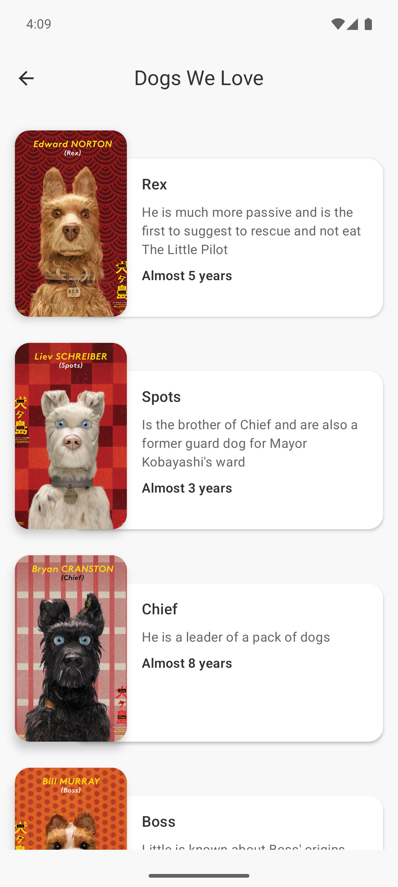

# Dogs We Love

Aplicación desarrollada con **Jetpack Compose**, que muestra una lista de perritos usando clean architecture y mejores prácticas.

---

## Características

- Clean Architecture (Presentation, Domain, Data)
- Jetpack Compose para UI declarativa
- Retrofit + Moshi para consumo de API REST
- Room para almacenamiento local
- Hilt para inyección de dependencias
- Soporte offline (carga desde base de datos local)

---

## Capturas de pantalla

| Lista de perritos             |
|-------------------------------|
| |
